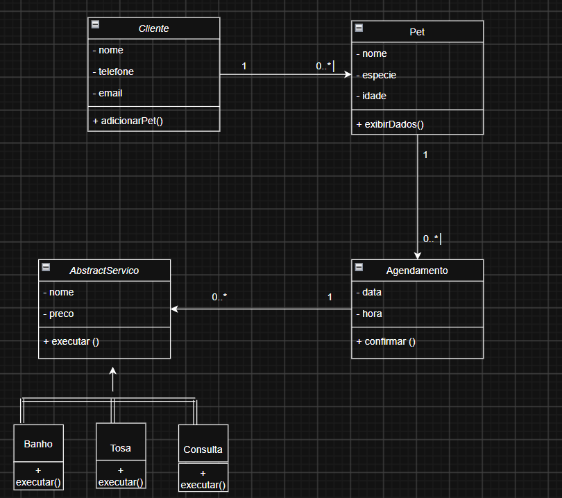
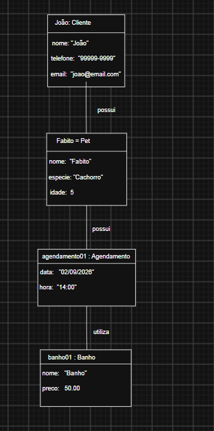

# Atividade de POO — Sistema de Petshop (H1)

Projeto escolhido: Petshop, aplicando os quatro pilares da Programação Orientada a Objetos (Abstração, Herança, Polimorfismo e Encapsulamento).

## Diagrama de classes 

**Abstração:** representada pela classe abstrata Serviço, que contém características e comportamento comum aos diferentes serviços que tem em um petshop.

**Herança:** as classes Banho, Tosa e Consulta herdam da classe Servico.

**Polimorfismo:** o método executar() pode apresentar comportamentos diferentes nas classes Banho, Tosa e Consulta.

**Encapsulamento:** os atributos das classes são privados, sendo acessados e manipulados através de métodos públicos.

## Diagrama de objetos 

### Mensagens entre os objetos: 

- joao.adicionarPet(fabito)

O objeto joao (instância de Cliente) invoca o método adicionarPet(), passando o objeto fabito (instância de Pet) como parâmetro, associando o pet ao cliente.

